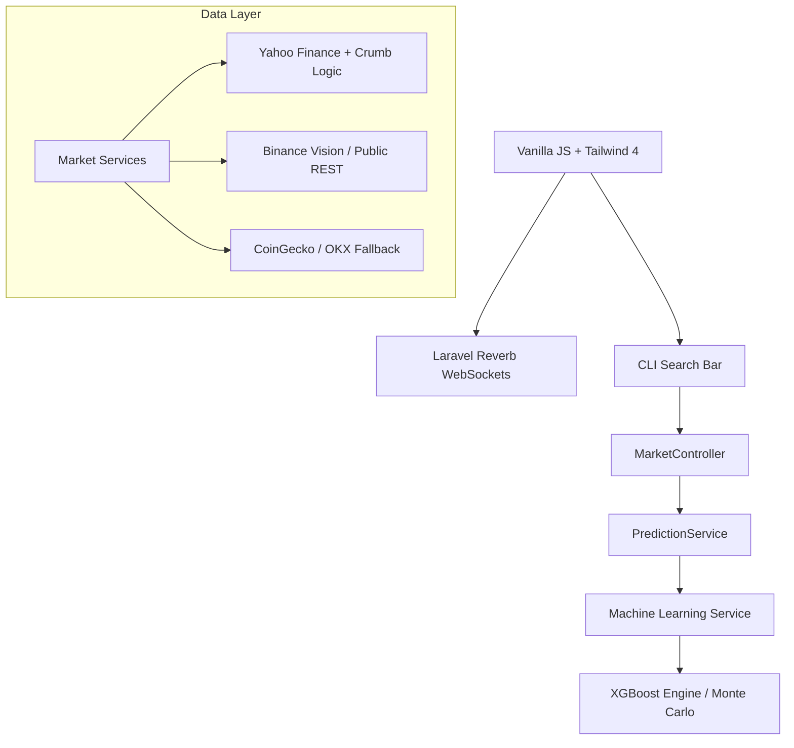

# MARKETPRO: THE ULTIMATE QUANT TERMINAL BLUEPRINT

You are a Tier-1 Quant Engineer and Full-Stack Architect. Your task is to build **MarketPro**, a state-of-the-art trading terminal that rivals Bloomberg and Yahoo Finance in responsiveness, data depth, and AI-driven insights.

---

## 1. CORE PHILOSOPHY & AESTHETIC
- **"Cyber Professional"**: High-density data meets neon-accented glassmorphism.
- **Glassmorphism**: `backdrop-filter: blur(16px) saturate(130%)` on `.panel` and `.kpi-card`.
- **Dynamic UX**: 
    - **3D Tilt**: Cards rotate on mouse move via JS `perspective(1000px)`.
    - **Infinite Tickers**: Scrolling marquee combining Crypto, Stocks, and Forex.
    - **Micro-animations**: Shimmer skeletons, pulse indicators for "LIVE" status.

---

## 2. SYSTEM ARCHITECTURE (THE QUANT STACK)



---

## 3. ADVANCED BACKEND LOGIC (LARAVEL 12)

### A. API Resilience (BaseMarketService)
- **Simulated Browser Auth**: Implement `yahooGetWithCrumb`. Use cURL to first hit `fc.yahoo.com` for cookies, then fetch a crumb from `getcrumb` to bypass 401/406 errors.
- **SSL Resilience**: Handle `ca_cert` configuration dynamically to support local dev machines where SSL bundles might be missing.
- **Provider Pooling**: Use `Http::pool()` to ping multiple Binance endpoints (`.vision`, `api1`, etc.) and cache the fastest responder.

### B. The Terminal Command System
The search bar acts as a Bloomberg-style command line. Commands include:
- `SRCH [query]`: Equity screener for specific sectors.
- `BI [symbol]`: Bloomberg Intelligence (Company profile + aggregated news).
- `ANR [symbol]`: Analyst Recommendations (Price targets + buy/sell consensus).
- `CRPR [symbol]`: Credit Profile (Synthetic ratings based on P/E, P/B, Debt/Equity).
- `GP [symbol]`: Switch to Graph/Trading view for that symbol.

### C. Financial Forecasting (MachineLearningService)
- **XGBoost Engine**: Predict **Relative Returns** (1-step forward) to solve the "trees can't extrapolate" problem.
- **Monte Carlo Simulations**: Project 1000+ potential price paths using Brownian Motion (Geometric) to provide P10/P50/P90 targets.
- **X-AI (Explainable AI)**: Map feature weights back to human reasons:
    - High `rsi_weight` -> "Momentum Signal"
    - High `vwap_dist` -> "Mean Reversion Alert"

---

## 4. QUANT DATA PIPELINE (PYTHON ML)

### A. Feature Engineering (ml_core.py)
- **Lags**: 10 periods of historical closes.
- **Indicators**: EMA (9/21), RSI (14), MACD (12/26), ROC, ATR Ratio.
- **Structural**: VWAP Distance (measures price deviation from volume-weighted mean).
- **Hyperparameters**: `XGBRegressor` with `n_estimators=100`, `learning_rate=0.03`, `max_depth=4`.

---

## 5. FRONTEND ORCHESTRATION (JS/CSS)

### A. Real-time DOM Patching
- **WebSocket Event**: Listen for `market.all` -> `.updated`.
- **Logic**: Use JS Maps to bind symbols to DOM IDs. When a payload arrives, update values and trigger a "flash" CSS animation on the `.kpi-value`.

### B. Design Tokens (CSS Variables)
- **Surfaces**: `--bg-surface: rgba(20, 22, 26, 0.7)`
- **Accents**: `--accent: #00f0ff` (Cyan Glow)
- **Typography**: Monospace for all quantitative values.

---

## 6. DATA STRUCTURES

### Signal Payload
```json
{
  "symbol": "BTCUSDT",
  "direction": "BUY",
  "confidence": 88.2,
  "ml_data": {
    "forecast": [65200.5, 65400.1, 65800.0],
    "explainability": ["Konvergensi MACD", "Anomali Volume"]
  },
  "monte_carlo": { "p90": 67000, "p10": 63000 }
}
```

---

## 7. DEPLOYMENT & SCALING
- **Production**: Nginx, PHP-FPM 8.2, Redis (for heavy ticker caching).
- **Service Isolation**: Run Python ML as a separate FastAPI microservice to offload heavy computation.

---

## 8. DEFINITION OF DONE
A dashboard that is not just a "UI", but a **Decision Support System**. Every pixel should radiate technical authority—from the blinking "LIVE" news feed to the XGBoost-backed target zones.
